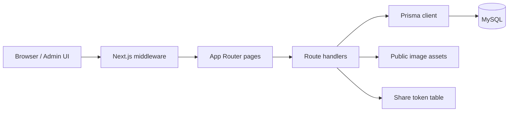

# Architecture

## High-level flow

## Main layers

- **App shell**: [app/layout.tsx](../app/layout.tsx) wires the auth provider, theme provider, and toast system.
- **Admin UI**: [app/admin/page.tsx](../app/admin/page.tsx) loads and edits patient/report structures.
- **Persistence**: [prisma/schema.prisma](../prisma/schema.prisma) defines patients, reports, share tokens, users, and audit logs.
- **API surface**: route handlers under [app/api](../app/api) expose auth, report persistence, sharing, and image upload endpoints.
- **Security layer**: [middleware.ts](../middleware.ts) protects routes and enforces role checks.

## Data model notes

- `Patient` is the parent record for report collections.
- `Report` stores the report body and links to many nested tables.
- `User` stores auth state, lockout counters, and activity metadata.
- `ShareToken` stores encrypted share links and optional password protection.

## Operational notes

- The app should be treated as a stateful service because it depends on MySQL and uploaded public assets.
- The legacy [app/api/comprehensive-report-data/route.ts](../app/api/comprehensive-report-data/route.ts) endpoint is not part of the main persistence path and should be treated as compatibility code, not the system of record.
